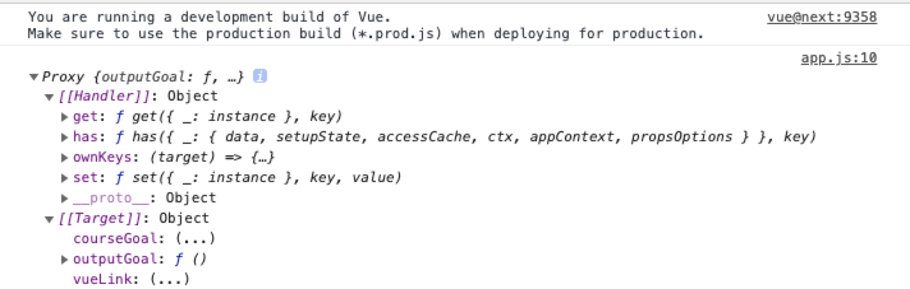

# 12. Module Introduction

* What we will learn:
  * How exactly Vue interact with HTML
    * Vue + HTML = Templates
  * Outputting Dynamic Content
  * Reacting to User Input 

# 13. Creating and Connecting Vue App Instance

- Vue를 html 코드에 연결하는 방법에 대해 배워보자!

1. `Vue.createApp()`으로 Vue 앱 인스턴스 만들고

2. HTML에서 어느 부분이 Vue에 의해 제어될지 `app.mount('css-selector')`를 통해 알려줌

3. `Vue.createApp()`에 자바스크립트 객체를 넣어줌으로서 HTML을 어떻게 제어할지 설정함

  * 한가지 주요 옵션은 `data` 설정
  * `data` 키에는 함수를 넣어줘야함(function as a value)
    * `data : function(){}`
    * `data() {}`
  * `data` 키에 등록된 함수는 "반드시" object를 리턴해야 함
    * 리턴되는 object를 통해 Vue 앱이 html을 어떻게 제어할지 결정

- code 

  <details>
  <summary>index.html</summary>

  ```html
  <!DOCTYPE html>
  <html lang="en">
    <head>
      <meta charset="UTF-8" />
      <meta name="viewport" content="width=device-width, initial-scale=1.0" />
      <title>Vue Basics</title>
      <link
        href="https://fonts.googleapis.com/css2?family=Jost:wght@400;700&display=swap"
        rel="stylesheet"
      />
      <link rel="stylesheet" href="styles.css" />
      <script src="https://unpkg.com/vue@next" defer></script>
      <script src="app.js" defer></script>
    </head>
    <body>
      <header>
        <h1>Vue Course Goals</h1>
      </header>
      <section id="user-goal">
        <h2>My Course Goal</h2>
        <p></p>
      </section>
    </body>
  </html>
  ```
  </details>

# 14. Interpolation and Data Binding

* Vue 앱이 컨트롤하는 HTML에서 데이터를 출력하기 위한 특별한 syntax가 있음.
  * Vue가 내부적으로 하는 일?
    * HTML 코드를 스캔
    * Vue에서 쓰는 syntax가 있는지 확인

* Interpolation 이란? : 뇌피셜로 짐작해보면 단어 뜻 그 자체 대로 두 pole(점)을 이어 주는 느낌. 여기서 pole이 데이터가 될 듯
  * `{{ }}` 형태로 쓰면 됨

* code

  <details>
  <summary>index.html</summary>

  ```html
  <!DOCTYPE html>
  <html lang="en">
    <head>
      <meta charset="UTF-8" />
      <meta name="viewport" content="width=device-width, initial-scale=1.0" />
      <title>Vue Basics</title>
      <link
        href="https://fonts.googleapis.com/css2?family=Jost:wght@400;700&display=swap"
        rel="stylesheet"
      />
      <link rel="stylesheet" href="styles.css" />
      <script src="https://unpkg.com/vue@next" defer></script>
      <script src="app.js" defer></script>
    </head>
    <body>
      <header>
        <h1>Vue Course Goals</h1>
      </header>
      <section id="user-goal">
        <h2>My Course Goal</h2>
        <p>{{ courseGoal }}</p>
      </section>
    </body>
  </html>
  ```
  </details>

  <details>
  <summary>app.js</summary>

  ```js
  const app = Vue.createApp({
    data(){
      return {
        courseGoal : "Finish the course and learn Vue!"
      };
    }
  });

  app.mount('#user-goal')
  ```
  </details>

# 15. Binding Attributes with the "v-bind" Directive
* v-bind 디렉티브의 필요성
  * HTML 콘텐츠에 대한 data bind는 data interpolation `{{...}}`을 활용하면 간단하게 처리할 수 있음.
  * 하지만, Vue 앱에서 관리하는 데이터를 통해 HTML 태그의 attribute를 동적으로 제어하고 싶다면 어떻게 해야할까?

  

  * Vue에서는 HTML attribute를 제어하기 위한 syntax로 v-bind 디렉티브를 제공함
  * v-bind 디렉티브는 HTML 엘리먼트 중 태그의 attribte를 Vue 앱에서 관리하는 데이터와 bind 하기 위한 명령어

* v-bind 디렉티브의 활용 방법
  * HTML
    ```html
    <p>Learn More <a href="https://vuejs.org/">about Vue</a>.</p>
    ```
  * Vue
    ```html
    <p>Learn More <a v-bind:href="vueLink">about Vue</a>.</p>
    ```

# 16. Understanding "methods" in Vue Apps
* Vue 앱이 HTML 제어를 위해 활용하는 data 프로퍼티는 key as function의 형태인 반면
* methods는 object를 key로 함.

* code 
  <details>
  <summary>index.html</summary>

  ```html
  <!DOCTYPE html>
  <html lang="en">
    <head>
      <meta charset="UTF-8" />
      <meta name="viewport" content="width=device-width, initial-scale=1.0" />
      <title>Vue Basics</title>
      <link
        href="https://fonts.googleapis.com/css2?family=Jost:wght@400;700&display=swap"
        rel="stylesheet"
      />
      <link rel="stylesheet" href="styles.css" />
      <script src="https://unpkg.com/vue@next" defer></script>
      <script src="app.js" defer></script>
    </head>
    <body>
      <header>
        <h1>Vue Course Goals</h1>
      </header>
      <section id="user-goal">
        <h2>My Course Goal</h2>
        <p>{{ outputGoal() }}</p>
      </section>
    </body>
  </html>
  ```
  </details>

  <details>
  <summary>app.js</summary>

  ```js
  const app = Vue.createApp({
    data(){
      return {
        courseGoal : "Finish the course and learn Vue!"
      };
    },
    methods: {
      outputGoal() {
        const randomNumber = Math.random();
        if (randomNumber < 0.5) {
          return 'Learn Vue!';
        } else {
          return 'Master Vue!';
        }
      }
    }
  });

  app.mount('#user-goal')
  ```
  </details>

# 17. Working with Data inside of a Vue App
* Vue 앱은 HTML을 제어하기 위한 설정 object를 `createApp()` 메소드의 전달인자로 전달한다.
* 이 때, 해당 object의 설정에는 대표적으로 data property(function as a value), methods property 등이 있다.
* 근데 method에서 data의 property에 접근하려면 어떻게 해야할까?
  * 답은 바로 `this` 키워드를 사용하는 것이다.
  * Vue는 `Vue.createApp({...})`에서 전달된 object 내의 함수 형태인 data property의 리턴 값인 object를 Vue 앱 생성 시, Vue의 내부적인 동작을 통해 아래 그림처럼 프록시 object 형태로 만드는 듯! 
  * 이에 따라 data property의 리턴 값인 object, 그리고 methods property에 등록된 object 들이 Vue 앱 생성 시 만들어 진 프록시 object에 등록되기 때문에 `this` 키워드로 접근이 가능한 듯!
    * 이부분은 내가 아직 ECMAScript 문법이나 용례에 대하여 잘 몰라서 확실하지는 않기 때문에, 나중에 공부 더 해보고 다시 한번 생각해봐야겠다.
  


 * code
    <details>
    <summary>index.html</summary>

    ```html
    <!DOCTYPE html>
    <html lang="en">
      <head>
        <meta charset="UTF-8" />
        <meta name="viewport" content="width=device-width, initial-scale=1.0" />
        <title>Vue Basics</title>
        <link
          href="https://fonts.googleapis.com/css2?family=Jost:wght@400;700&display=swap"
          rel="stylesheet"
        />
        <link rel="stylesheet" href="styles.css" />
        <script src="https://unpkg.com/vue@next" defer></script>
        <script src="app.js" defer></script>
      </head>
      <body>
        <header>
          <h1>Vue Course Goals</h1>
        </header>
        <section id="user-goal">
          <h2>My Course Goal</h2>
          <p>{{ outputGoal() }}</p>
        </section>
      </body>
    </html>
    ```
    </details>

    <details>
    <summary>app.js</summary>

    ```js
    const app = Vue.createApp({
      data(){
        return {
          courseGoalA : "Finish the course and learn Vue",
          courseGoalB : "Master Vue and build amazing apps!",
          vueLink: 'https://vuejs.org/'
        };
      },
      methods: {
        outputGoal() {
          const randomNumber = Math.random();
          if (randomNumber < 0.5) {
            return this.courseGoalA;
          } else {
            return this.courseGoalB;
          }
        }
      }
    });

    app.mount('#user-goal')
    ```
    </details>

# 18. Outputting Raw HTML Content with v-html
* 필요성
  * 말 그대로 Vue 앱에서 관리하는 data를 HTML에서 출력함에 있어서, html 태그가 데이터 내에 포함되어 있으면
  * XSS 등의 보안 문제 등이 발생 가능할 수 있기 때문에, 이러한 html 출력과 관련된 directive를 별개의 syntax로 제공함 

* 사용법
  ```html
  <p v-html="outputGoal()"></p>
  ```

# 19. A - First Summary

# Assign1 : Time to Pratice : Data Binding
* [link_assign1](../src/Assign_01)

# 20. Understanding Event Binding && 21. Events & Methods
* 모던 웹을 구성하는데 있어 필수 요소 중 사용자의 입력인 `이벤트`를 Vue 앱에서 처리하는 방법에 대해 배움
* Vue에서 이벤트를 다루는 방법에 대해 알아보기 전에 Vue 이전에는 어떤 방식으로 이벤트를 핸들링했는지 정리해보자

  * button 클릭 시 이벤트 핸들러 호출
    ```js
    //common click handler
    let clickHandler = function(event) {
      console.log('click handler called : ', event);
    }
    ```

  * Vanilla Javascript (getElementsByTagName, querySelector)
    ```js
    let btns_1 = document.getElementsByTagName('button');
    for (let btn of btns_1) {
      btn.addEventListener('click', clickHandler);
    }

    /* Vanilla JS - queryselector*/
    let btns_2 = document.querySelectorAll('button');
    for (let btn of btns_2) {
      btn.addEventListener('click', clickHandler);
    }
    ```

  * JQuery
  
    ```js
    let $btns_3 = $('button')
    for(btn of $btns_3) {
      btn.addEventListener('click', clickHandler());
    }

    ```

* vue에서 이벤트를 처리하는 방법?
  * `v-on` 디렉티브 사용
    *  `v-on:click="your_handler` 
    *  `@click=your_handler`

* code

  <details>
  <summary>index.html</summary>

  ```html
  <!DOCTYPE html>
  <html lang="en">
    <head>
      <meta charset="UTF-8" />
      <meta name="viewport" content="width=device-width, initial-scale=1.0" />
      <title>Vue Basics</title>
      <link
        href="https://fonts.googleapis.com/css2?family=Jost:wght@400;700&display=swap"
        rel="stylesheet"
      />
      <link rel="stylesheet" href="styles.css" />
      <script src="https://unpkg.com/vue@next" defer></script>
      <script src="app.js" defer></script>
    </head>
    <body>
      <header>
        <h1>Vue Events</h1>
      </header>
      <section id="events">
        <h2>Events in Action</h2>
        <button v-on:click="add">Add</button>
        <button v-on:click="reduce">Reduce</button>
        <p>Result: {{ counter }}</p>
      </section>
    </body>
  </html>
  ```
  </details>

  <details>
  <summary>app.js</summary>

  ```js
  const app = Vue.createApp({
    data() {
      return {
          counter: 0,
      };
    },
    methods : {
      add() {
          this.counter += 1;
      },
      reduce() {
          this.counter -= 1;
      }
    }
  });

  app.mount('#events');
  ```
  </details>

* Event 인터페이스?
  * DOM 내에 위치한 이벤트를 말함
  * Event 발생?
    * 사용자 입력 : 마우스 클릭, 키보드 입력 등
    * API가 생성 : 비동기 작업 등의 진행을 나타내기 위한 목적 등으로 사용되기도 함.
  * Event 생성 방법( `programmnatic` )?
    * `HTMLElement.click()` 메서드 호출
    * 이벤트 정의 후 특정 대상에 대해 `dispatch`
      * `EventTarget.dispatchEvent()`

  * 많은 DOM 요소에서 Event 수신/처리 코드를 실행 가능
    * 이벤트 처리기는 일반적으로 `EventTarget.addEventListener()`를 통해, 다양한 DOM 요소 `<button> <div> <span> ...` 에 부착됨.
    * 이벤트 처리기 제거 : `removeEventListener()`

  * 다양한 Event : https://developer.mozilla.org/ko/docs/Web/Events

# 22. Working with Event Arguments
* 이벤트 핸들러 메소드에서 전달인자를 활용하는 방법
* code
  <details>
    <summary>index.html</summary>

    ```html
    <section id="events">
      <h2>Events in Action</h2>
      <button v-on:click="add(5)">Add</button>
      <button v-on:click="reduce(5)">Reduce</button>
      <p>Result: {{ counter }}</p>
    </section>
    ```
  </details>

  <details>
    <summary>app.js</summary>

    ```js
    const app = Vue.createApp({
      data() {
        return {
          counter: 0,
        };
      },
      methods : {
        add(num) {
          this.counter += num;
        },
        reduce(num) {
          this.counter -= num;
        }
      }
    })
    ```
  </details>


# 23. Using the Native Event Object
* 사용자가 `<input>`, `<select>` 및 `<textarea>` HTML 요소에 `입력한 값`을 활용하는 방법?
  * `Event interface` 의 `target 속성` 을 활용하면 됨
  * `<triggred_event>.target.value`

* 여기서 전달인자로 주어진 `event`는 `javascript event object`

* `input 이벤트`는 `<input>`, `<select>` 및 `<textarea>` 요소의 `value` 속성이 바뀔 때마다 발생한다.

* code
  <details>
    <summary>index.html</summary>

    ```html
    <section id="events">
      <h2>Events in Action</h2>
      <button v-on:click="add(5)">Add</button>
      <button v-on:click="reduce(5)">Reduce</button>
      <p>Result: {{ counter }}</p>
      <input type="text" v-on:input="setName($event, 'kim')">
      <p>Your Name: {{ name }} </p>
    </section>
    ```
  </details>

  <details>
    <summary>app.js</summary>

    ```js
    const app = Vue.createApp({
      data() {
        return {
          counter: 0,
          name: "",
        };
      },
      methods : {
        add(num) {
          this.counter += num;
        },
        reduce(num) {
          this.counter -= num;
        },
        setName(event, lastName) {
          this.name = event.target.value + ' ' + lastName;
        }
      }
    })
    ```
  </details>

* Event 트리거하는 방법(팁)
  ```js
  let btn = $('button')[0];
  let event = new Event('click');
  btn.dispatchEvent(event);

  ```

# 24. Exploring Event Modifiers
* HTML에서 `form` 태그를 만들어서 `submit button` 을 통해 `form` 데이터를 전송하면, 해당 `form` 내의 데이터를 서버측에 전송하고, 서버측에서 HTML을 자동으로 받아 렌더링하는 일련의 브라우저 기본 동작이 실행됨.

* 일반적인 웹앱의 경우 이러한 현상이 문제가 될 것은 별로 없지만, Vue의 경우 Vue 인스턴스 내의 데이터 또한 리프레시 되어버리기 때문에, 사용중인 데이터 또한 날라가 버리는 현상이 발생함.

* 따라서 Vue를 쓰다보면, 이러한 browser default 동작을 prevent해야하는 필요성이 생김.

* 하지만 Vue의 `v-on` 디렉티브로 form 데이터 전송에 대한 이벤트 리스너를 등록하더라도, 이러한 browser default로 인한 페이지 리프레시는 여전히 발생하게 됨.

* 이럴 때 사용할 수 있는 Vue의 기능이 `prevent modifier`
  
  <details>
    <summary>manner 1 : event.preventDefault()</summary>

    * index.html 
  
    ```html
      <form v-on:submit="submitFormHandler">
        <input type="text" />
        <button>Sign Up</button>
      </form>
    ```
    
    * app.js 

    ```js
      const app = Vue.createApp({
        data() {
          return {
            name : ''
          };
        },
        methods: {
          submitFormHandler(event){
            event.preventDefault();
            alert('submitted');
          }
        }
      })
    ```
  </details>
  
  <details>
    <summary>manner 2 : v-on:submit.prevent="handler" </summary>
    
    * index.html

    ```html
      <form v-on:submit.prevent="submitHandler">
        <input type="text" name="tmp"/>
        <button>Sign Up</button>
      </form>
    ```

  </details>

* HTML form 기초

  ```html
  <form action="/my-handling-form-page" method="post">
      <div>
          <label for="name">Name:</label>
          <input type="text" id="name" name="user_name"/>
      </div>
      <div>
          <label for="mail">E-mail:</label>
          <input type="email" id="mail" name="user_id"/>
      </div>
      <div>
          <label for="msg">Message:</label>
          <textarea id="msg" name="user_msg"></textarea>
      </div>

      <div class="button">
          <button type="submit">Send your message</button>
      </div>
  </form>
  ```

  * `action` attribute : 데이터를 보낼 URL을 지정
  * `method` attribute : 어떤 HTTP 방식을 사용할지 지정(GET, POST, ...)
  * `label`의 `for` attribute : 모든 `<label>` 요소에서 `form` 위젯과 `label`을 연결하기 위해 사용
    * `label` 의 `for` attribute와 해당 `label` 과 연결되는 `<input> <textarea>` 등의 `id` attribute이 매핑됨
  * `<input>`의 `type` attribute : `<input>` 요소가 어떻게 입력을 받을지를 정의
    * [상세 : native form widgets](https://developer.mozilla.org/en-US/docs/Learn/Forms/Basic_native_form_controls)
  * 버튼 종류 3가지
    * `submit` : `submit` 속성이 지정된 버튼을 클릭하면, 정의된 `form`에 입력된 데이터를 `<form>` 요소의 `action` 속성에 정의된 웹 페이지에 전송함
    * `reset` : 모든 `form` widget을 기본 값으로 변경. (UX 관점에서 권장하지 않는 방법)
    * `button` : 클릭해도 기본적으로는 아무것도 안함. (js를 사용하여 사용자가 정의한 기능을 수행하는 버튼으로 활용할 때 많이 사용됨)
  * `<input>` 요소를 사용하여 버튼을 만들 수도 있음.
    * 해당 방법과 `<button>`을 사용하는 방식의 큰 차이점은, `<input>`요소를 사용할 경우 오직 일반 텍스트만 전송되는 반면, `<button>`을 사용할 경우 전체 HTML 콘텐츠를 전송 가능
    * `<input type="button" value="click" />`
    
  * `HTML form` 내의 `submit` attribue 가 지정된 `<button>`을 클릭하면, `form`에 사용자가 입력한 데이터를 서버로 전송함
    * 전송되는 `form` 의 데이터는 `name` attribute로 지정한 이름(데이터의 이름)으로 식별 가능함
    * 지정된 이름에 따라 데이터가 `key-value pair` 로 전송됨


* 이렇게 event modifier는 form 데이터 전송과 같이 브라우저의 기본적인 동작들을 변경할 수 있는 수단이 됨
  * right click 이벤트에 대해서도 아래처럼 변경 가능
    ```html
    <button v-on:click.right="reduce(5)">Subtract 5</button>
    ```

  * enter keyup 이벤트(ctrl, shift, page-down, ...)
    ```html
    <input 
      type="text"
      v-on:input="setName($event, 'Schwarzmüller')"
      v-on:keyup.enter="setConfirmedName"
    />
    ```

# 25. Locking Content with v-once
* 잘은 안쓰이는 디렉티브
* interpolation을 비롯한 다양한 data binding 시, 오직 한번만 데이터가 evaluated 되게 됨.

```html
<p v-once>Result : {{ counter }}</p>
```

# Assign2 : Time to Practice : Event Binding
* [link_assign2](../src/Assign_02)

# 26. Data Binding + Event Binding = Two-Way Binding

## Two Way Binding
* `v-bind:value` + `v-on:input` => `v-model:<name>`

* 앞서 Vue 앱의 데이터가 DOM에 반영되는 `Data Binding`과, DOM에서 발생한 사용자의 입력 이벤트를 Vue 앱 내에서 접근하는 `Event Binding` 방법에 대해 살펴보았음.
* 그런데 다음의 패턴과 같이 사용자의 입력을 받는 Input Form이 있고, 사용자가 reset 버튼을 눌렀을 때, 해당 Input Form 내의 value를 공백으로 초기화 해주는 경우를 생각해보자
* 이 경우는 Input Form과 같이 사용자의 입력 이벤트에 대한 바인딩과, reset 버튼을 눌렀을 때 변경되는 Vue 앱 내의 데이터를 다시 DOM에 반영해주는 데이터에 대한 바인딩 과정이 모두 필요함.

* 먼저 아래와 같이, `document.querySelector`를 활용하여 DOM 내의 데이터를 직접 변경하는 방식으로 리셋 로직을 구현해보자. 
  * (이 방법이 안되는 이유는??)

  <details>
  <summary>Example Code : document.querySelector를 사용한 방법</summary>

  ```html
  <body>
    <header>
      <h1>Vue Events</h1>
    </header>
    <section id="events">
      <h2>Events in Action</h2>
      <button v-on:click="add(10)">Add 10</button>
      <button v-on:click="reduce(5)">Subtract 5</button>
      <p>Result: {{ counter }}</p>
      <input type="text" v-on:input="setName($event)">
      <p>Your Name: {{ name }}</p>

      <!-- Today's concern -->
      <button>Reset</button>
    </section>
  </body>
  ```

  ```js
  const app = Vue.createApp({
    data() {
      return {
        counter: 0,
        name: ''
      };
    },
    methods : {
      setName(event) {
        this.name = event.target.value;
      },
      add(num) {
        this.counter += num;
      },
      reduce(num) {
        this.counter -= num;
      },
      resetInput() {
        // (Hacky) : 이 방법은 input 엘리먼트 내의 value를 공백으로 초기화
        // 지워진 값이 Vue app의 name 데이터에 반영이 안됨
        document.querySelector('input').value = '';
      }
    }
  });

  app.mount("#events");
  ```

  </details>

* Vue의 feature를 활용하여 데이터와 템플릿을 양방향으로 바인딩하는 방법?
  * 양방향 바인딩 방법 -> `Event Binding + Data Binding`
  * 사용자가 Input Form에 데이터를 입력하였을 발생하는 이벤트를 통해, Vue 앱 내의 데이터를 관리하는 `Event Binding`
    * Input 엘리먼트의 value 값을 Vue 앱 인스턴스에 저장
    * `this.name = event.target.value;` 
  * Vue 앱 인스턴스 내의 name 데이터 -> DOM : `Data Binding`
    * Input 엘리먼트의 `value` 속성을 활용!
    * `<input v-bind:value="name" />`

* Vue의 양방향 바인딩 방법 1
  ```html
  <input type="text" v-bind:value="name" v-on:input="setName($event)" />
  ```
  <details>
  <summary>Example Code : Vue Feature 1(v-bind, v-on)</summary>

  ```html
  <body>
    <header>
      <h1>Vue Events</h1>
    </header>
    <section id="events">
      <h2>Events in Action</h2>
      <button v-on:click="add(10)">Add 10</button>
      <button v-on:click="reduce(5)">Subtract 5</button>
      <p>Result: {{ counter }}</p>
      <input type="text" v-bind:value="name" v-on:input="setName" />
      <p>Your Name: {{ name }}</p>

      <!-- Today's concern -->
      <button @click="resetInput">Reset</button>
    </section>
  </body>
  ```

  ```js
  const app = Vue.createApp({
    data() {
      return {
        counter: 0,
        name: ''
      };
    },
    methods : {
      setName(event) {
        this.name = event.target.value;
      },
      add(num) {
        this.counter += num;
      },
      reduce(num) {
        this.counter -= num;
      },
      resetInput() {
        this.name = '';
      }
    }
  });

  app.mount("#events");
  ```
  </details>

  * How it works?
    1. 사용자가 Reset Button 클릭 : Click Event Handler 호출
        * `this.name = '';`

    2. Vue 인스턴스 내의 `name` 데이터가 변경되었기 때문에, `v-bind`를 통해 바인딩 된 `input` 엘리먼트의 `value` 속성(`name`)이 업데이트 됨!
        * `<input type=text value="">`

    3. 해당 `input` 엘리먼트의 `value` 속성이 변경되었기 떄문에, 등록된 `event handler`인 `setName() method`가 실행되어, Vue 앱 인스턴스의 `this.name` 값이 해당 `input`엘리먼트의 `value` 속성의 값으로 업데이트 됨
        * `input` 이벤트는 `<input>` 요소의 `value` 속성이 변경될 때 마다 발생!

* Vue의 양방향 바인딩 방법 2
  * Vue는 위와 같은 `v-bind:value=<data_name>` + `v-on:input="eventHandler"` 을 통한 데이터 바인딩을 위한 `v-model` 디렉티브를 지원
  * `v-model:<data_name>`
  
  ```html
  <input type="text" v-model="name" />
  ```
  <details>
  <summary>Example Code : Vue Feature 2(v-model)</summary>

  ```html
  <body>
    <header>
      <h1>Vue Events</h1>
    </header>
    <section id="events">
      <h2>Events in Action</h2>
      <button v-on:click="add(10)">Add 10</button>
      <button v-on:click="reduce(5)">Subtract 5</button>
      <p>Result: {{ counter }}</p>
      <input type="text" v-model="name" />
      <p>Your Name: {{ name }}</p>

      <!-- Today's concern -->
      <button @click="resetInput">Reset</button>
    </section>
  </body>
  ```

  ```js
  const app = Vue.createApp({
    data() {
      return {
        counter: 0,
        name: ''
      };
    },
    methods : {
      add(num) {
        this.counter += num;
      },
      reduce(num) {
        this.counter -= num;
      },
      resetInput() {
        this.name = '';
      }
    }
  });

  app.mount("#events");
  ```
  </details>


# 27. Methods used for Data Binding: How It Works

* Vue 템플릿에서 데이터 interpolation을 사용할 때, 템플릿 내의 함수 호출 지양
* Why?
  * Vue는 내부적으로 변경된 데이터를 캐싱해놓고 변경 사항이 있을 때만 DOM에 없데이트 함.
  * 하지만 템플릿 내에서 데이터가 아닌 함수 호출의 리턴값을 받아서 데이터로 사용하는 아래의 예제와 같은 경우, Vue 앱이 내부적으로 

<details>
<summary>Advanced Reactivity</summary>

```html
<body>
  <header>
    <h1>Vue Events</h1>
  </header>
  <section id="events">
    <h2>Events in Action</h2>
    <button v-on:click="add(10)">Add 10</button>
    <button v-on:click="reduce(5)">Subtract 5</button>
    <p>Result: {{ counter }}</p>
    <input type="text" v-model="name" />
    <p>Your Name: {{ outputFullName() }}</p>

    <!-- Today's concern -->
    <button @click="resetInput">Reset</button>
  </section>
</body>
```

```js
const app = Vue.createApp({
  data() {
    return {
      counter: 0,
      name: ''
    };
  },
  methods : {
    add(num) {
      this.counter += num;
    },
    reduce(num) {
      this.counter -= num;
    },
    resetInput() {
      this.name = '';
    },
    outputFullName() {
      if(this.name === '') {
        return '';
      }
      return this.name + ' kim'
    }
  }
});

app.mount("#events");
```
</details>

# 28. Introducing Computed Properties

# 29. Working with Watchers

# 30. Methods vs Computed Properties vs Watchers

# 31. v-bind and v-on Shorthands

# Assigin 3 : Time to Practice: Reactivity

# 32. Dynamic Styling with inline Styles

# 33. Adding CSS Classes Dynamically

# 34. Classes & Computed Properties

# 35. Dynamic Classes: Array Syntax

# Assign 4 : Time to Practice : Dynamic Styling

# 36. Module Summary

# Module Resources